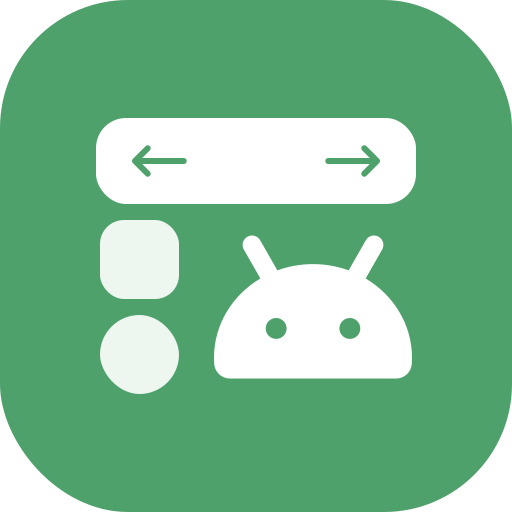

# Hikage

[](https://github.com/BetterAndroid/Hikage/blob/main/LICENSE)
[](https://t.me/BetterAndroid)
[](https://t.me/HighCapable_Dev)
[](https://qm.qq.com/cgi-bin/qm/qr?k=Pnsc5RY6N2mBKFjOLPiYldbAbprAU3V7&jump_from=webapi&authKey=X5EsOVzLXt1dRunge8ryTxDRrh9/IiW1Pua75eDLh9RE3KXE+bwXIYF5cWri/9lf)



A Kotlin DSL-based Android real-time UI building framework.

English | [简体中文](README-zh-CN.md)

|  | [BetterAndroid](https://github.com/BetterAndroid) |
|---------------------------------------------------------------------------------------------------------------------------------|---------------------------------------------------|

This project belongs to the organization above. **Click the link to follow us** and discover more awesome projects.

## What's this

`Hikage` (Pronunciation /ˈhɪkɑːɡeɪ/), this is a Kotlin DSL-based Android UI building framework
that focuses on **real-time code-based UI construction**.

The project icon was designed by [MaiTungTM](https://github.com/Lagrio),
the name is taken from the original song "Haru**hikage**" in "BanG Dream It's MyGO!!!!!".

<details><summary>Why...</summary>
  <div align="center">
  

**なんで春日影レイアウト使いの？**
  </div>
</details>

Unlike Jetpack Compose which demands a complete paradigm shift and rewrite,
Hikage is laser-focused on the native Android View ecosystem.
It brings the sleek, declarative UI DX to the classic View framework,
allowing you to build layouts blazing fast with 100% out-of-the-box support for legacy and standard native components.

## Why Hikage?

Hikage is mainly suitable for developers focusing on native Android platform development.
Since Kotlin became the primary development language, there hasn't been a perfect solution to implement dynamic code layouts using DSL.
Therefore, projects that do not use Jetpack Compose still need to use the original XML. Although ViewBinding provides support, it is still not very
user-friendly.

Hikage inherits the design schemes of [Anko](https://github.com/Kotlin/anko) and [Splitties](https://github.com/LouisCAD/Splitties),
and draws on the DSL function naming scheme of Jetpack Compose. On this basis, it has made many improvements,
making it closer to native in terms of usage cost and closer to Jetpack Compose in terms of writing style.

> Comparison of various DSL layout schemes

<details open><summary>Hikage</summary>

```kotlin
LinearLayout(
    lparams = LayoutParams(matchParent = true) {
        topMargin = 16.dp
    },
    init = {
        orientation = LinearLayout.VERTICAL
        gravity = Gravity.CENTER
    }
) {
    TextView {
        text = "Hello, World!"
        textSize = 16f
        gravity = Gravity.CENTER
    }
}
```

</details>

<details><summary>Anko、Splitties</summary>

```kotlin
verticalLayout {
    gravity = Gravity.CENTER
    textView("Hello, World!") {
        textSize = 16f
        gravity = Gravity.CENTER
    }
}.lparams(
    width = matchParent,
    height = matchParent
) {
    topMargin = dip(16)
}
```

</details>

<details><summary>Jetpack Compose</summary>

```kotlin
Column(
    modifier = Modifier.padding(top = 16.dp),
    verticalArrangement = Arrangement.Center,
    horizontalAlignment = Alignment.CenterHorizontally
) {
    Text(
        text = "Hello, World!",
        fontSize = 16.sp,
        textAlign = TextAlign.Center
    )
}
```

</details>

The basic part of Hikage **does not require any external or additional compilation plugins**.
It can be **plug-and-play** and **create a View object anywhere** that can be set to the parent layout and `Window`.

Hikage **fully supports** hybrid layouts. You can embed XML (using the `R.layout` scheme to load layouts), ViewBinding, and even Jetpack Compose
within Hikage.

Compared with Anko and Splitties, Hikage supports an **in-memory AAPT2 resource parsing emulator**,
capable of **dynamically constructing an `AttributeSet`**. This solution has been tested on emulators and real devices,
ensuring **stable compatibility with Android 5.0.2 (API 21) ~ 17 (API 37)**.
This empowers legacy custom views that lack programmatic setters to be revitalized via Hikage.

> The following example

```kotlin
TextView(
    attrs = {
        android {
            // The following is equivalent to android:text="Set text in dynamic AttributeSet".
            set("text", "Set text in dynamic AttributeSet")
            set("textSize", "16sp")
            set("gravity", "center")
            set("paddingLeft", "8dp")
            // Supports dynamic type conversion.
            set("paddingRight", 8.dp)
        }
    }
) {
    text = "Overridden text in code"
}
```

From now on, forget about ViewBinding, XML, and even `findViewById`, and just try using code-based layouts!

**Don't know Jetpack Compose? No worries, today Hikage is your Kotlin DSL version of XML,
refactoring your most familiar muscle-memory components into the most modern declarative UI,
enjoying the same writing experience with higher development efficiency and better runtime performance.**

Hikage works best when used in conjunction with our other project [BetterAndroid](https://github.com/BetterAndroid/BetterAndroid), and
Hikage itself will automatically reference its [ui-extension](https://betterandroid.github.io/BetterAndroid/en/library/ui-extension) as a core
dependency.

## Get Started

|  | [Hikage Documentation](https://betterandroid.github.io/Hikage/en) |
|---------------------------------------------------------------------|-------------------------------------------------------------------|

You can go to the documentation page for more detailed tutorials and content.

### What's next?

1. **Add dependencies**: Add the **hikage-core** dependency and the dependencies you need to your project.
2. **Sync the project**: After a Gradle sync, you can start using `Hikage`.

In the opened page, select the **Quick Start** section in the sidebar to continue reading.

## More Projects

<!--suppress HtmlDeprecatedAttribute -->
<div align="center">
    <h2>Hey, wait a second! 👋</h2>
    <h3>If this project was helpful, why not stick around and check out more of my work below?</h3>
    <h3>Feel free to leave a follow or a star ⭐️ if they bring you value!</h3>
    <h1><a href="https://github.com/fankes/fankes/blob/main/project-promote/README.md">→ Click here to discover more of my projects ←</a></h1>
</div>

## Star History


## Third-Party Open Source Usage Statement

- [AndroidHiddenApiBypass](https://github.com/LSPosed/AndroidHiddenApiBypass)

## License

- [Apache-2.0](https://www.apache.org/licenses/LICENSE-2.0)

```
Apache License Version 2.0

Copyright (C) 2019 HighCapable

Licensed under the Apache License, Version 2.0 (the "License");
you may not use this file except in compliance with the License.
You may obtain a copy of the License at

    https://www.apache.org/licenses/LICENSE-2.0

Unless required by applicable law or agreed to in writing, software
distributed under the License is distributed on an "AS IS" BASIS,
WITHOUT WARRANTIES OR CONDITIONS OF ANY KIND, either express or implied.
See the License for the specific language governing permissions and
limitations under the License.
```

Copyright © 2019 HighCapable