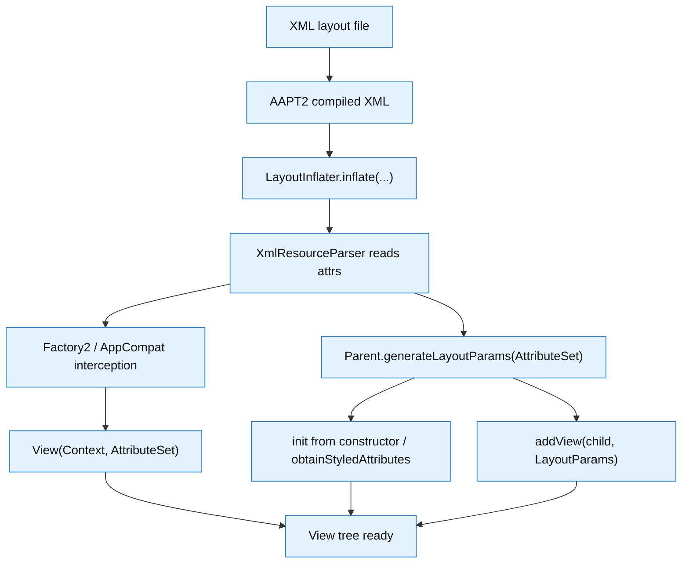
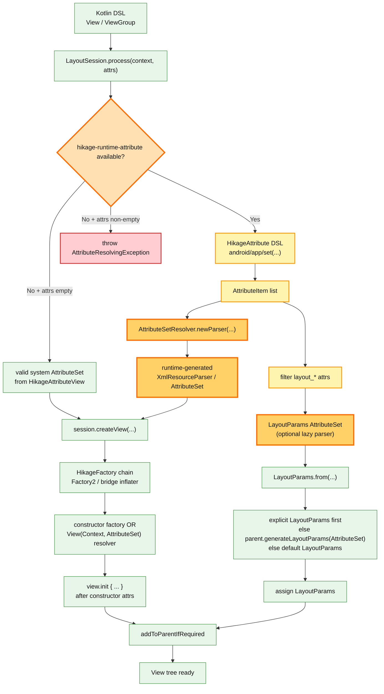

# Architecture

> Here introduces the architecture background, design motivation, build process, and benchmark report of the `Hikage` project.

## Project Motivation

Hikage did not happen by accident. It started as the kind of project you build when the platform around you keeps nudging everyone toward a shiny new thing,
while the code you actually maintain still lives in the old world. As Google went all in on Jetpack Compose and the classic Android View ecosystem started to feel increasingly sidelined,
I wrote Hikage as a bit of a "fine, I will build the thing I need myself" project. Back in 2023, `LazyColumn` performance issues were rough enough to make a lot of Android developers wince,
and a perfect official answer did not arrive quickly. Then the 1.6.0 to 1.7.0 era brought its own stream of bugs, which made me much less confident about betting everything on Jetpack Compose.
At the same time, real-world codebases cannot always be rebuilt around Compose from scratch. That is basically asking a team to move into a new ecosystem while the old one is still paying rent.
Anko was already dead, XML layouts felt old-school, and the middle ground was missing.
So I decided to build a Kotlin DSL layout framework fully based on the View system: something that stays compatible with the existing Android View ecosystem while giving developers a modern authoring experience closer to Jetpack Compose.

That is how Hikage was born in 2025. The original vision was not huge. It was meant to be a small DSL layout tool.
Some friends around me thought I was working on something with no past and probably no future, maybe even wasting time, because most people believed Jetpack Compose was the future.
I did not fully buy that. Even as Jetpack Compose becomes more mature, it cannot - and should not - completely replace the Android View ecosystem.
The View system is part of Android's foundation. Jetpack Compose is a modern UI framework, and in my view it should complement Android rather than erase what came before it.

In the first generation, I used [AndroidHiddenApiBypass](https://github.com/LSPosed/AndroidHiddenApiBypass) to reflect `XmlBlock`,
manually built a valid empty `AttributeSet`, and successfully entered the system layout loading pipeline. That made `LayoutInflater.Factory2` support possible, and this became the complete form of Hikage 1.0.0.

During the first year after Hikage went open source, a number of developers in the community gave it a try.
But it soon hit a ceiling: at its core, it still looked like "a second Anko", and it was missing one critical feature - dynamically building `AttributeSet`.
The story gets a little funny here. In the middle of the AI coding wave, I did not ask AI to magically "build the whole aircraft carrier" for me.
In early June this year, with a one-month Claude subscription from a friend, I used the then top-tier Opus 4.8 model to implement little-endian XML construction and an in-memory AAPT2 parser.
Claude gave me a three-layer architecture plan (T0-T2):

- Tier 0 (T0) handles enum and flag attribute parsing, which are stable symbolic constants
- Tier 1 (T1) handles Android framework attributes, which are also relatively stable
- Tier 2 (T2) handles the more complicated custom attribute parsing for attributes defined by third-party libraries and apps in `attrs.xml`

> Document layout (little-endian ResChunk format)

```:no-line-numbers
RES_XML_TYPE
 ├─ RES_STRING_POOL_TYPE          (attribute names first, then uris/prefixes/element/values)
 ├─ RES_XML_RESOURCE_MAP_TYPE     (uint32[] resId, parallel to the leading attribute-name strings)
 ├─ RES_XML_START_NAMESPACE_TYPE  (one per distinct namespace)
 ├─ RES_XML_START_ELEMENT_TYPE    (attrExt + attributes)
 ├─ RES_XML_END_ELEMENT_TYPE
 └─ RES_XML_END_NAMESPACE_TYPE    (reverse order)
```

At that point, Claude had basically done its curtain call. In the development that followed, I kept tuning the project with GPT 5.5,
from feature fixes to module decoupling and even the supporting Lint checks. In the end,
Hikage filled in a niche that still had people looking at it. It sounds cool, but it also comes with a lot of unknowns. I know Hikage is only just getting started.

## Build Process

Let's take a closer look at the build process of XML and Hikage runtime. These two flowcharts illustrate the build process of XML layout files and Hikage Kotlin DSL layouts.

> Traditional XML Pipeline



> Hikage Runtime Pipeline



## Benchmark Report

Below are some representative benchmark reports of Hikage on different devices and Android versions after multiple tests.

|                              Device                               | Android Version | API Level |
| :---------------------------------------------------------------: | :-------------: | :-------: |
|            [Xiaomi Mi-4c](/benchmarkReports/Mi-4c-7.0)            |       7.0       |    24     |
|           [Huawei P9](/benchmarkReports/EVA-AL10-8.0.0)           |      8.0.0      |    26     |
|           [Xiaomi MI 5s](/benchmarkReports/Mi-5s-8.0.0)           |      8.0.0      |    26     |
|          [Huawei P10 Plus](/benchmarkReports/VKY-AL00-9)          |        9        |    28     |
|            [Hisense A9](/benchmarkReports/HLTE203T-10)            |       10        |    29     |
|              [OPPO A9](/benchmarkReports/PCAM10-11)               |       11        |    30     |
|          [Huawei nova 8](/benchmarkReports/ANG-AN00-12)           |       12        |    31     |
|        [Xiaomi Mi MIX 2S](/benchmarkReports/Mi-MIX-2S-13)         |       13        |    33     |
|      [Redmi Note 12 Turbo](/benchmarkReports/23049RAD8C-15)       |       15        |    35     |
|        [Xiaomi 15 Ultra](/benchmarkReports/25019PNF3C-16)         |       16        |    36     |
| [Google Pixel 9 Pro (AVD)](/benchmarkReports/Pixel_9_Pro(AVD)-17) |       17        |    37     |

If you want to run the benchmark tests manually, first you need to clone the project,
then connect your Android device, open Android Studio, and run the `benchmarkViewTreeReport` task in the `samples:demo-benchmark` module.

Alternatively, you can use the following commands in the terminal to run the benchmark tests,
and the report will be automatically displayed in the default browser.

> Linux, macOS

```bash
./gradlew :samples:demo-benchmark:benchmarkViewTreeReport
```

> Windows

```ps1
.\gradlew.bat :samples:demo-benchmark:benchmarkViewTreeReport
```