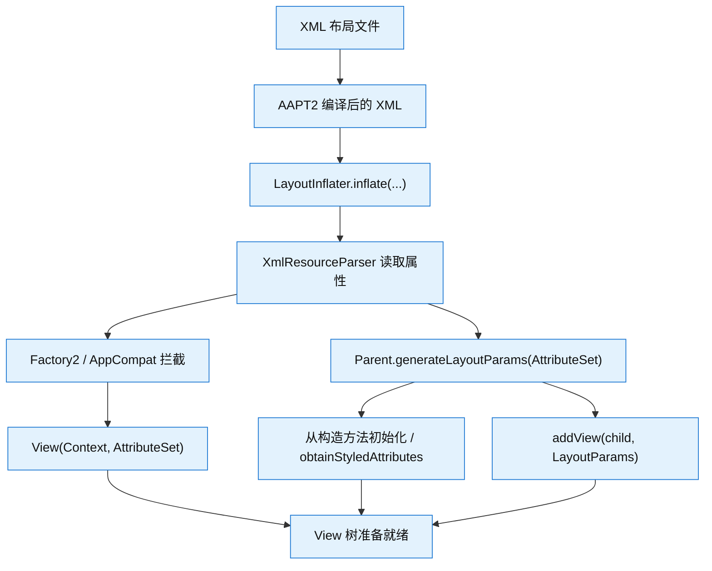
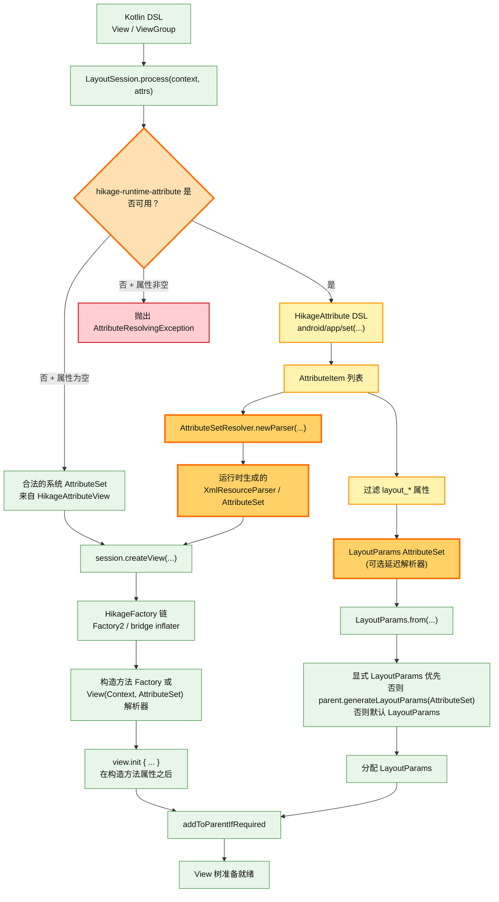

# 架构

> 这里介绍了 `Hikage` 项目的架构背景、设计动机、构建流程以及基准报告。

## 项目动机

这个项目的诞生并非巧合。在 Google 全面拥抱 Jetpack Compose、开始边缘化传统 Android View 生态的背景下，它是我的 “愤笔之作”。当年 2023
版的 `LazyColumn` 性能问题曾一度 “卡炸” 整个 Android 生态圈，而官方迟迟未能给出完美的解决方案；随后 1.6.0 到 1.7.0
版本也是层出不穷的 BUG，这让我对 Jetpack Compose 的未来充满疑虑。同时，受限于存量代码，现有项目很难完全使用 Jetpack Compose
进行重构，这无异于另起炉灶建立一套新生态，改造成本极其高昂。当时 Anko 已经停止维护，而传统的 XML 布局方式又显得过于陈旧。面对这种进退两难的局面，我决定自己动手开发一套完全基于
View 系统的 Kotlin DSL 布局框架——它既能完美兼容现有的 Android View 生态，又能带来媲美 Jetpack Compose 的开发现代化体验。

于是，Hikage 在 2025 年诞生了。最初它的愿景并不宏大，仅仅是作为一个小巧的 DSL
布局工具而存在。当时身边的朋友认为我是在做一件 “前无古人，后无来者” 甚至有些浪费时间的事情，他们大多数人认为 Jetpack Compose 才是未来。但我并不完全认同，即便
Jetpack Compose 日趋成熟，它也无法、更不能完全取代 Android View 生态。View 系统是 Android 的根基，而 Jetpack Compose 是一个现代化的 UI 框架，它应当是 Android 生态的补充，而不是彻底的替代品。

在初代版本中，我通过 [AndroidHiddenApiBypass](https://github.com/LSPosed/AndroidHiddenApiBypass) 把 `XmlBlock` 反射出来，徒手构造了一个合法的空
`AttributeSet`，成功进入了系统的布局装载管线，使其支持了 `LayoutInflater.Factory2`，这便是 Hikage 1.0.0 的完全体。

Hikage 开源的一年间，圈内有不少开发者进行了尝试。但很快它就遇到了瓶颈：它本质上似乎只是 “第二个 Anko”，缺少一个核心且致命的功能——动态构建 `AttributeSet`。
事情也充满了戏剧性，在 AI Coding 潮流席卷的当下，我并没有选择让 AI 直接帮我 “造出整艘航空母舰”。今年 6 月初，借助于朋友送我的一个月
Claude 订阅，我使用当时最顶级的 Opus 4.8 模型实现了小端序构建 XML 和内存级别的 AAPT2 解析器。当时 Claude 为我提供了三层架构方案 (T0-T2)：

- 第一层 (T0) 是枚举/标志属性解析，它们是万年不变的符号常量
- 第二层 (T1) 是 Framework 层的 Android 系统属性，同样相对固定
- 第三层 (T2) 则是更为复杂的自定义属性解析，它们属于第三方库和 App 定义在 `attrs.xml` 中的属性组合

> 文档布局 (小端序 ResChunk 格式)

```:no-line-numbers
RES_XML_TYPE
 ├─ RES_STRING_POOL_TYPE          (attribute names first, then uris/prefixes/element/values)
 ├─ RES_XML_RESOURCE_MAP_TYPE     (uint32[] resId, parallel to the leading attribute-name strings)
 ├─ RES_XML_START_NAMESPACE_TYPE  (one per distinct namespace)
 ├─ RES_XML_START_ELEMENT_TYPE    (attrExt + attributes)
 ├─ RES_XML_END_ELEMENT_TYPE
 └─ RES_XML_END_NAMESPACE_TYPE    (reverse order)
```

到这里，Claude 的工作其实就完美谢幕了。在后续的开发中，我借助 GPT 5.5 模型不断进行调优，从功能修复到模块解耦，甚至编写了配套的 Lint 检查，最终完成了这个尚有人问津的领域。这听起来很酷，但也充满了未知的挑战。因为我知道，Hikage 才刚刚启程。

## 构建流程

下面我们来仔细看看 XML 与 Hikage 运行时的构建流程，这两张流程图分别介绍了 XML 布局文件和 Hikage Kotlin DSL 布局构建流程。

> 传统 XML 管线



> Hikage 运行时管线



## 基准报告

以下是一些具有代表性经过我们多次测试后，Hikage 在不同设备和 Android 版本下的基准报告。

|                               设备                                | Android 版本 | API 级别 |
| :---------------------------------------------------------------: | :----------: | :------: |
|            [Xiaomi Mi-4c](/benchmarkReports/Mi-4c-7.0)            |     7.0      |    24    |
|           [Huawei P9](/benchmarkReports/EVA-AL10-8.0.0)           |    8.0.0     |    26    |
|           [Xiaomi MI 5s](/benchmarkReports/Mi-5s-8.0.0)           |    8.0.0     |    26    |
|          [Huawei P10 Plus](/benchmarkReports/VKY-AL00-9)          |      9       |    28    |
|            [Hisense A9](/benchmarkReports/HLTE203T-10)            |      10      |    29    |
|              [OPPO A9](/benchmarkReports/PCAM10-11)               |      11      |    30    |
|          [Huawei nova 8](/benchmarkReports/ANG-AN00-12)           |      12      |    31    |
|        [Xiaomi Mi MIX 2S](/benchmarkReports/Mi-MIX-2S-13)         |      13      |    33    |
|      [Redmi Note 12 Turbo](/benchmarkReports/23049RAD8C-15)       |      15      |    35    |
|        [Xiaomi 15 Ultra](/benchmarkReports/25019PNF3C-16)         |      16      |    36    |
| [Google Pixel 9 Pro (AVD)](/benchmarkReports/Pixel_9_Pro(AVD)-17) |      17      |    37    |

如果你想手动运行基准测试，首先你需要 Clone 当前项目，然后连接你的 Android 设备，打开 Android Studio，运行 `samples:demo-benchmark` 模块中的
`benchmarkViewTreeReport` 任务。

或者你可以在终端使用以下命令来执行基准测试，测试完成后将自动在默认浏览器中展示报告。

> Linux、macOS

```bash
./gradlew :samples:demo-benchmark:benchmarkViewTreeReport
```

> Windows

```ps1
.\gradlew.bat :samples:demo-benchmark:benchmarkViewTreeReport
```